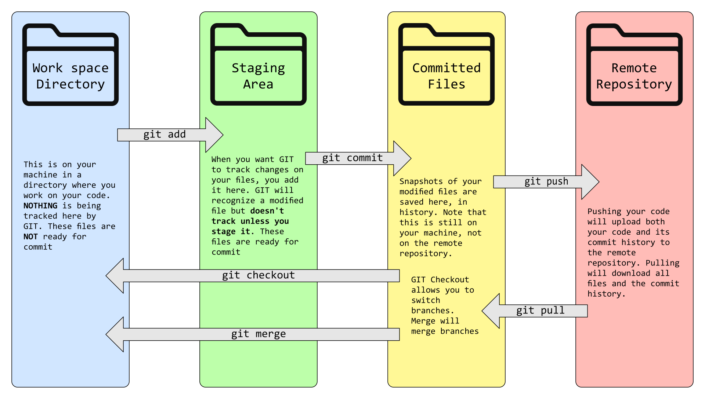

# GitHub Full Dive

Created by: Caleb

### Before Starting:

> [!TIP]
> Some sections of this dive are summarized for you to easily understand and apply the concepts. If you want to learn more than the summarized version is given, clicking the link will give you more detailed information and examples. To find the original article that was summarized, look for this statement in each section:
>
> _This section is summarized from the article [link]_

> [!IMPORTANT]
> You are required to read articles tagged with the amount of time to read. Do not skip over these articles as they provide valuable information on how to apply the feature. An example is shown below:
>
> - [link] - 3 mins

# GitHub Intro

## Files and Folders

### Files

There are many types of files:

- **Document Files:** pdf, word, xlsx, ppt, txt, md, etc
- **Media Files:** png, mp4, mp3, gif, jpg, etc
- **Program Files:** html, py, js, java, etc

They are typically given the name of the file with the format at the end.

- `name-of-file.format`
- `cat.png` or `Main.java`

A file is a collection of data stored as a unit on a computer. It can contain text, images, programs, or any other type of information. **All programs and data** are written to or read from a file. These instructions, or code, are interpreted or compiled by a computer to perform specific tasks.

### Folders (Also called directories)

Folders or directories are an organizational tool used to arrange files so you can store them neatly.

- Can hold many different types of files
- Can be named to quickly identify contents
- Can be put within each other

Some folders are specialized to contain code. These are called a repository, a special type of folder. It's a central location where code, documentation, and other project files are stored and managed. Repositories are often used with version control systems like Git to track changes, collaborate with others, and maintain a history of the project's development.

## Git & Repositories

_This section is summarized from the article [About GitHub and Git](https://docs.github.com/en/get-started/start-your-journey/about-github-and-git)_

Git is a powerful version control system that helps developers manage and track changes to their code over time. Think of it as a time machine for your projects.

A repository is a central location where all the files and folders of a project are stored. It's like a digital warehouse for your code. Git allows you to create multiple versions of your project, compare changes, and collaborate with other developers.

Git can:

- **Track changes:** Record every modification made to the code.
- **Collaborate efficiently:** Work on projects with multiple team members simultaneously.
- **Revert to previous versions:** Roll back to earlier stages of the project if needed.
- **Branch and merge**: Experiment with new features without affecting the main codebase.

Essentially, Git and repositories provide a structured and efficient way to manage software development projects.

> [!NOTE]
>
> - Git is the underlying technology, a version control system that tracks changes to files over time.
> - GitHub is a cloud-based platform that provides a user-friendly interface and additional features for working with Git repositories.
>
> They are not the same thing. GitHub uses Git as a way to manage and track code in the cloud. In essence, Git is the engine that powers version control, while GitHub is the platform that makes it accessible and collaborative.

# Connecting Your IDE

Now that you understand the basics of what Git is, let's add it to the IDE.

You'll need to create a GitHub Account and link a GitHub Repository to the IDE. Restricted access is for those who are working on Chromebooks or computers that don't have access to GitHub. Regular access is for those who do have access to GitHub on their computer and want to sign into GitHub automatically.

- [Restricted Access: Link GitHub to VSCode](https://docs.google.com/presentation/d/1sSJEyJDiNvWRryz5Uf32xsFG6aphf1amna9CFw5BIJU/edit?usp=sharing)
- [Regular Access: Log in to GitHub Account](https://code.visualstudio.com/docs/sourcecontrol/intro-to-git)

Use this guide to quickly understand and use Git Tools within VSCode:

- [Using Git in VSCode - Full dive](https://code.visualstudio.com/docs/sourcecontrol/overview)
- [Working with GitHub in VS Code](https://code.visualstudio.com/docs/sourcecontrol/github) - 8 mins

# Working with Git

_This section is summarized from the articles [About Git](https://docs.github.com/en/get-started/using-git/about-git), [Pushing commits to a remote repository](https://docs.github.com/en/get-started/using-git/pushing-commits-to-a-remote-repository), and [Getting changes from a remote repository](https://docs.github.com/en/get-started/using-git/getting-changes-from-a-remote-repository)._

1. Clone:

- Purpose: Creates a local copy of a remote repository on your machine.
     - Command: `git clone <remote_repository_url>`
     - Example: `git clone https://github.com/user/repo.git` This will create a new directory named "repo" on your machine, containing all the files and history from the remote repository.

2. Fetch:

- Purpose: Downloads the latest commits from a remote repository without merging them into your local branches.
     - Command: `git fetch <remote_name>`
     - Example: `git fetch origin` This will update your local repository's knowledge of the remote repository's state.

3. Pull:

- Purpose: Fetches changes from a remote repository and merges them into your current branch.
     - Command: `git pull <remote_name> <branch_name>`
     - Example: `git pull origin main` This will fetch the latest commits from the "main" branch of the "origin" remote and merge them into your current branch.

4. Commit:

- Purpose: Saves changes to your local repository.
     - Command: `git commit -m "commit message"`
     - Example: `git commit -m "Fixed bug in feature X"` This will create a snapshot of your current working directory and save it to your local repository.

5. Push:

- Purpose: Uploads local commits to a remote repository.
     - Command: `git push <remote_name> <branch_name>`
     - Example: `git push origin main` This will push your local commits to the "main" branch of the "origin" remote repository.

6. Branch:

- Purpose: Creates a new branch.
     - Command: `git branch <branch_name>`
     - Example: `git branch feature_x` This will create a new branch named "feature_x" that branches off from your current branch.

7. Checkout:

- Purpose: Switches between branches.
     - Command: `git checkout <branch_name>`
     - Example: `git checkout main` This will switch your working directory to the "main" branch.

8. Merge:

- Purpose: Combines changes from one branch into another.
     - Command: `git merge <branch_name>`
     - Example: `git merge feature_x` This will merge the changes from the "feature_x" branch into your current branch.

9. Status:

- Purpose: Shows the current state of your working directory.
     - Command: git status This will display information about untracked files, changes to tracked files, and the current branch.

You can use this cheat sheet to remember commands and concepts:

- [Git Cheat Sheet](https://training.github.com/downloads/github-git-cheat-sheet/)
- [Git Cheat Sheet PDF](https://training.github.com/downloads/github-git-cheat-sheet.pdf)

## Interacting with Remote Repositories

There are two main models for collaboration:

- **Shared Repository:** All developers have direct access to the central repository.

- **Fork and Pull:** Developers create their copies (forks) of the repository. They make changes in their fork, then create a pull request to merge their changes back into the original repository.

### Pushing Changes (`git push`):

- To upload your local commits to the remote repository, use `git push <remote> <branch>`. For example, `git push origin my-branch` pushes the `my-branch` from your local repository to the `origin` remote.

### Pulling Changes (`git pull`):

- To download changes from a remote repository and merge them into your local branch, use `git pull <remote> <branch>`. This is a shortcut for `git fetch` (which downloads changes) followed by `git merge`.

- **`git fetch`:** `git fetch <remote>` downloads the latest changes from the remote without merging them immediately. You can then inspect the changes and decide when to merge.

- **Merge Conflicts:** If you have conflicting changes (you and someone else changed the same lines), `git pull` will stop, and you'll need to manually resolve the conflicts before completing the merge. `git merge --abort` cancels a merge in progress.

You can see how these commands work together in this Git Diagram


> [!NOTE]
> All of these commands are done in the terminal. However, you'll likely be using VSCode and GitHub Desktop to expedite the process. Instead, you'll be working with a GUI, but all the concepts are still the same. It just isn't in a terminal.

# Collaborating on GitHub

_This section is summarized from the article [Communicating on GitHub](https://docs.github.com/en/get-started/using-github/communicating-on-github)._

GitHub offers different tools for different communication needs within a repository:

## 1. Issues:

Use for tracking specific tasks, bugs, feature requests, and feedback related to the codebase. Issues are repository-specific, often have assigned owners, and generally lead to actionable tasks (like a fix or improvement). In essence, GitHub's bug-tracking system.

- More reading: [About Issues](https://docs.github.com/en/issues/tracking-your-work-with-issues/about-issues)

- How to: [Creating an issue](https://docs.github.com/en/issues/tracking-your-work-with-issues/using-issues/creating-an-issue)

#### When to Use?

- You need to track tasks, report bugs, give feedback on a feature, or ask questions about repository files.

## 2. Pull Requests (PRs):

Use for proposing specific code changes. PRs allow commenting on proposed changes, collaborative review, and integrating code into the repository. They are repository-specific and directly tied to code modifications.

- Further down we'll discuss the use of PRs and how to create one.

#### When to use?

- You want to fix a typo, make code changes, fix an issue with code, or comment on suggested changes.

## 3. Discussions:

Use for broader, open-ended conversations, community building, brainstorming, and sharing information that isn't directly tied to specific code changes. Discussions can span multiple repositories and don't always have a clear owner or lead to specific tasks. They function more like forums.

- More reading: [About Discussions](https://docs.github.com/en/discussions/collaborating-with-your-community-using-discussions/about-discussions)

- How to: [Quick start to Discussions](https://docs.github.com/en/discussions/quickstart)

#### When to use?

- You have a general question not related to specific files, want to share news, start an open-ended conversation, or make announcements to the community.

## Formatting

Github uses the Markdown format for all comments, posts, and replies. Use this as a guide to format your text: [Basic writing and formatting syntax](https://docs.github.com/en/get-started/writing-on-github/getting-started-with-writing-and-formatting-on-github/basic-writing-and-formatting-syntax).

# Workflow

_This section is summarized from the article [GitHub Flow](https://docs.github.com/en/get-started/using-github/github-flow)._

There are three core concepts:

- Branches: These are separate lines of development within your project. You can think of them as parallel timelines.
- Main Branch: This is the primary branch, representing the stable, production-ready code.
- Merge: This operation combines changes from one branch into another.

Here is the workflow that you'll follow for most projects.

1. **Start with a Main Branch:**
      - Begin with a stable main branch.
2. **Create a Feature Branch:**
      - When starting a new feature or bug fix, create a new branch from the main branch.
3. **Develop and Test:**
      - Work on your feature or fix within this branch, making commits as you go.
4. **Create a Pull Request:**
      - Once the feature is complete, create a pull request to merge the changes back into the main branch.
5. **Review and Merge:**
      - Other developers will review your code and provide feedback. If the changes are approved, they will be merged into the main branch.
6. **Deploy:**
      - Once merged into the main branch, the changes can be deployed to production.

Here is an example illustration of a Git Workflow:


> [!NOTE]
> Sometimes, urgent bugs need to be fixed immediately (emergency repairs). On tag 0.2 of the illustration, a hotfix branch can be created directly from the main branch to implement the fix. This hotfix is then merged into both the development and main branches to ensure both are updated.

> [!TIP]
> Commit often: This helps maintain a clear and concise project history.
>
> Branch strategically: Use branches to isolate work, experiment, and collaborate effectively.

Benefits of this Workflow:

- Clear Separation of Concerns: Development happens on a separate branch, so it doesn't interfere with the stable main branch.
- Flexibility and Collaboration: Multiple developers can work on features simultaneously through multiple feature branches.

Vincent Driessen provides a detailed overview of a successful Git branching model if you would like to know about this process more. It is outdated; however, it still provides valuable insights into versioning workflows.
[View the article here](https://nvie.com/posts/a-successful-git-branching-model/).

Next, you'll learn conventions to ensure clear and descriptive names for commits, pull requests, and branches. This helps everyone understand your purpose and avoids clutter.

# Git Conventions

**Guidelines:**

- **Atomic Commits:** Commit small and focused changes. Never commit multiple changes from multiple files.

- **Code Review:** Actively participate in reviewing pull requests and code. Provide constructive Feedback.

- **Stay Updated:** Actively fetch and pull any changes from the repository.

- **Consistent Style Guide:** Use an extension or follow coding style guides for consistent formats and syntax.

## Git Commit Messages

- **Clear and Concise:** Use clear and concise messages that accurately describe the changes made.
- **Present Tense:** Write messages in the present tense.
- **Imperative Mood:** Use the imperative mood (e.g., "Fix bug in login form").
- **Description:** Use the description part of the message to provide more detailed insights.

Example:

```
Fix bug in login form

The login form was not validating email addresses correctly. This commit fixes the validation logic to ensure that only valid email addresses are accepted.
```

## Git Branch Naming

- **Descriptive Names:** Use clear and descriptive names that reflect the purpose of the branch.
- **Lowercase and Hyphen-Separated:** Use lowercase letters and hyphens to separate words.

Example:

- **Feature Branches:** Use a prefix like feature/ (e.g., feature/login-form).
- **Bugfix Branches:** Use a prefix like bugfix/ (e.g., bugfix/broken-link).
- **Hotfix Branches:** Use a prefix like hotfix/ (e.g., hotfix/urgent-security-fix).

Sometimes you'll hear that you create or develop a "topic" which is essentially the broad term for features or bugfixes.

### Version Convention

When you release your software as a version, you will typically follow the Semantic Versioning 2.0.0 (SemVer 2.0.0) format, where versions are typically represented as X.Y.Z.

- **Major Version (X)**
    - Incremented when there are breaking changes that introduce incompatible APIs or significant changes in behavior.
    - This means existing code using the old version may require modifications to work with the new version.
- **Minor Version (Y)**
    - Incremented when new features are added in a backward-compatible way.
    - Existing code should continue to work without modifications.
    - These typically include feature updates.
- **Patch Version (Z)**
    - Incremented when bug fixes are made that do not introduce new features or break existing functionality.
    - These include security fixes or bug fixes.

Example:

- `v1.0.0`: Initial release of the software.
- `v1.1.0`: New feature added without breaking existing functionality.
- `v1.1.1`: Bug fix released without introducing new features or breaking existing functionality.
- `v2.0.0`: Major overhaul with significant changes that may break existing code.

## Pull Requests

### Titles

- **Clear and Concise:** Use clear and concise titles that accurately describe the changes.
- **Present Tense:** Write titles in the present tense.
- **Imperative Mood:** Use the imperative mood (e.g., "Fix bug in login form").

Example:

- Recommended: `Fix bug in login form`
- Not recommended: `Fixed login form bug`

### Descriptions

- **Clear and Concise:** Provide a clear and concise description of the changes.
- **Context:** Explain the context of the changes and why they were made.
- **Testing:** Describe the tests that were performed to verify the changes.

More conventions can be found here: [Best Practices](https://docs.github.com/en/pull-requests/collaborating-with-pull-requests/getting-started/best-practices-for-pull-requests)

# Proposing Changes, Reviewing Code, and Providing Feedback

## Branching

_This section is summarized from the article [About branching](https://docs.github.com/en/pull-requests/collaborating-with-pull-requests/proposing-changes-to-your-work-with-pull-requests/about-branches)_

As discussed before, branching is a way to separate development and production code. They allow you to work on new features, bug fixes, or experiments without affecting the main codebase (usually the `main` branch). Branches are created from existing branches, typically the default branch `main`. They are often called "feature branches" or "topic branches." On the branch, you can then test the code without consequence because it is not on the production branch. After testing and ensuring the code works, you can merge it back into the production branch for use.

Working with branches:

- **Merging:** Once work on a branch is complete, you merge it into another branch (usually the default branch) via a pull request.
- **Deleting Branches:** After a branch's pull request is merged, you can delete it to keep the repository organized. GitHub automatically updates related pull requests if a base branch is deleted. Branches associated with open pull requests cannot be deleted.
- **Protected Branch:** Repository admins can protect branches to prevent accidental or unauthorized changes. Protections enforce certain rules before merging. Including:
    - Preventing deletion or force-pushes to the branch.
    - Requiring a specific number of approving pull request reviews.
    - Requiring review from code owners.
    - Requiring signed commits.

To understand how to do this in GitHub, read the following:

- [Example of branching and pull requests](https://docs.github.com/en/pull-requests/collaborating-with-pull-requests/proposing-changes-to-your-work-with-pull-requests/about-branches#working-with-branches) - 2 min
- [Creating and Deleting branches from GitHub](https://docs.github.com/en/pull-requests/collaborating-with-pull-requests/proposing-changes-to-your-work-with-pull-requests/creating-and-deleting-branches-within-your-repository) - 2 mins

Learn Git Branching is a great website to understand how branching and merges work in GitHub. I would recommend going through a couple of the lessons to get the hang of branching.

- [Learn Git Branching](https://learngitbranching.js.org/)

## Pull Requests

_This section is summarized from the articles [About pull requests](https://docs.github.com/en/pull-requests/collaborating-with-pull-requests/proposing-changes-to-your-work-with-pull-requests/about-pull-requests) & [About PR reviews](https://docs.github.com/en/pull-requests/collaborating-with-pull-requests/reviewing-changes-in-pull-requests/about-pull-request-reviews)_

PR (Pull Request) proposes merging changes from one branch (usually a feature branch) into another (usually the main branch). It's a collaborative way to review code before merging. PRs facilitate code review, allowing multiple people to check for errors, improve code quality, and ensure consistency before changes go live. **PRs are crucial for avoiding conflicts and misinterpretation**

A PR shows diffs (differences) between branches, allows adding summaries and comments, and lets you link to related issues. After creating a PR, you can push more commits to update it. Once reviewed and approved, you can merge the PR, integrating the changes into the target branch. Merging might be blocked by required status checks or pending reviews. You can squash commits during merging for a cleaner history.

PR Reviews:

- The Review Process:
    - Anyone with read access can review and comment on PRs. Reviewers can approve, request changes, or leave comments.
- Review Statuses:
    - Reviews have three statuses: Comment, Approve, and Request changes. Only "Approve" allows merging (unless specific rules are configured).
- Required Reviews:
    - Repository admins can require a certain number of approvals before merging (e.g., two approvals from write-access users). This helps enforce code quality.
- Resolving Conversations:
    - You can mark conversations as resolved to organize the review process and indicate that feedback has been addressed.
- Re-requesting Reviews:
    - If significant changes are made after a review, you can re-request a review to get updated feedback.

To understand how to do this in GitHub, read the following:

- [Creating a Pull Request on GitHub](https://docs.github.com/en/pull-requests/collaborating-with-pull-requests/proposing-changes-to-your-work-with-pull-requests/creating-a-pull-request) - 3 mins
- [Requesting a Pull Request review](https://docs.github.com/en/pull-requests/collaborating-with-pull-requests/proposing-changes-to-your-work-with-pull-requests/requesting-a-pull-request-review) - 3 mins
- [Reviewing proposed changes in a pull request](https://docs.github.com/en/pull-requests/collaborating-with-pull-requests/reviewing-changes-in-pull-requests/reviewing-proposed-changes-in-a-pull-request) - 6 mins
- [Incorporating feedback in your pull request](https://docs.github.com/en/pull-requests/collaborating-with-pull-requests/reviewing-changes-in-pull-requests/incorporating-feedback-in-your-pull-request) - 2 mins

Further recommended reading but not required:

- [Commenting on a Pull Request](https://docs.github.com/en/pull-requests/collaborating-with-pull-requests/reviewing-changes-in-pull-requests/commenting-on-a-pull-request)
- [Update the head branch](https://docs.github.com/en/pull-requests/collaborating-with-pull-requests/proposing-changes-to-your-work-with-pull-requests/keeping-your-pull-request-in-sync-with-the-base-branch)
- [Comparing branches](https://docs.github.com/en/pull-requests/collaborating-with-pull-requests/proposing-changes-to-your-work-with-pull-requests/about-comparing-branches-in-pull-requests)
- [Dismissing a pull request review](https://docs.github.com/en/pull-requests/collaborating-with-pull-requests/reviewing-changes-in-pull-requests/dismissing-a-pull-request-review)

## Resolving merge conflicts

_This section is summarized from the article [About merge conflicts](https://docs.github.com/en/pull-requests/collaborating-with-pull-requests/addressing-merge-conflicts/about-merge-conflicts)_

When it comes to the most difficult part of Git, merge conflicts top it all. Merge conflicts occur when Git cannot automatically merge changes from different branches because of competing edits to the same lines or files. This happens when multiple people modify the same part of the code simultaneously.

1. Simple Conflicts (Line Changes):

- If the conflict involves different changes on the same line(s) within a file, you can often resolve it directly using GitHub's online conflict editor.

2. Complex Conflicts (File Deletions, etc.):

- For more complex conflicts (e.g. one person deleting a file while another modifies it), you must resolve the conflict locally using a Git client (the command line or GitHub Desktop). This involves manually editing the conflicted files to choose the desired changes, staging the changes, and then committing the fix. Only after resolving the conflict locally can you push your changes back to GitHub.

To help ease the headaches when you come across a merge conflict, here are some articles to help you out:

- [Resolving a merge conflict on GitHub](https://docs.github.com/en/pull-requests/collaborating-with-pull-requests/addressing-merge-conflicts/resolving-a-merge-conflict-on-github) - 3 mins
- [Resolving merge conflicts in VSCode](https://code.visualstudio.com/docs/sourcecontrol/overview#_merge-conflicts)

## Integrating The Change

_This section is summarized from the article [About pull request merges](https://docs.github.com/en/pull-requests/collaborating-with-pull-requests/incorporating-changes-from-a-pull-request/about-pull-request-merges)_

You can merge pull requests by retaining all the commits in a feature branch, squashing all commits into a single commit, or rebasing individual commits from the head branch onto the base branch.

1. **Create a merge commit**

This is the standard merge method. All commits from the feature branch are preserved and added to the base branch as a single merge commit. Git history shows a clear branch history with a merge point. This maintains complete history.

2. **Squash and merge**

All commits from the feature branch are combined into a single commit on the base branch. This results in a cleaner, more linear Git history, hiding the intermediate commits of the feature branch. Ideal for removing in-progress commits. The commit message can be customized or automatically generated (title, description, or list of squashed commit messages). **Repeated squashing and merging on a long-running branch can lead to increased merge conflicts later.**

3. **Rebase and merge**

The commits from the feature branch are re-written and appended directly onto the base branch, creating a linear history without a merge commit. Similar to a fast-forward merge but involves rewriting commit history.
This produces the cleanest Git history but requires more caution. **This may fail if there are merge conflicts or if the rebase is considered "unsafe" (could produce different results than a standard merge).** If it fails, you must rebase locally, resolve conflicts, and force-push. This should generally only be done for personal branches and not shared branches to avoid issues with collaborators' work.

4. **Indirect Merges**

A pull request can be automatically merged if its commits are already present in the base branch, either directly or through another merged pull request (i.e., a transitive merge). This applies only when the initial merge uses the "Create a merge commit" option. Squash and rebase merges won't trigger indirect merges. **Importantly, indirect merges bypass branch protection rules.**

To understand how to do this in GitHub, read the following:

- [Merging a pull request](https://docs.github.com/en/pull-requests/collaborating-with-pull-requests/incorporating-changes-from-a-pull-request/merging-a-pull-request) - 3 mins
- [Merge PR Automatically](https://docs.github.com/en/pull-requests/collaborating-with-pull-requests/incorporating-changes-from-a-pull-request/automatically-merging-a-pull-request) - 2 mins
- [Closing a pull request](https://docs.github.com/en/pull-requests/collaborating-with-pull-requests/incorporating-changes-from-a-pull-request/closing-a-pull-request) - <1 min
- [Reverting a pull request](https://docs.github.com/en/pull-requests/collaborating-with-pull-requests/incorporating-changes-from-a-pull-request/reverting-a-pull-request) - < 1 min

# Congrats! 🎉

You've completed the full dive into GitHub. You can now fully collaborate on GitHub and understand the processes behind branching, PRs, commits, merging, and more!
